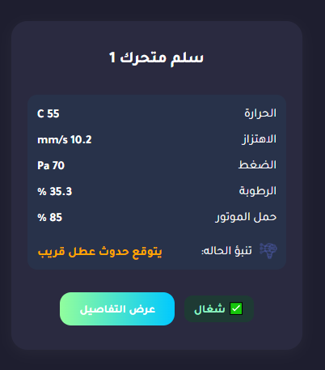

# 🛫 Sabiq – Aviation Safety Prototype

This project is a prototype for reporting and visualizing technical safety incidents in an aviation environment. It consists of a frontend interface (HTML, CSS, JavaScript) and a backend API built with Express.js to manage incident data via a local JSON file.

---

## 📁 Project Structure

```
sabiq/
├── backend/
│   ├── ai-model/                
│   │   └── analyze_incidents.py              # AI logic for analyzing incidents
│   │
│   ├── data/
│   │   ├── facilities.json                   # Facility list
│   │   ├── incidents.json                    # Reported incidents
│   │   ├── incidentData.json                 # Labeled training data
│   │   ├── notifications.json                # System notifications
│   │   ├── output.json                       # Model prediction outputs
│   │   ├── tasks.json                        # Assigned tasks for technicians
│   │   └── users.json                        # User credentials and roles
│   │
│   ├── facility-fault-model/      
│   │   ├── rf_model.pkl                      # Pretrained model (Random Forest)
│   │   └── model_api.py                      # Flask API for inference
│   │
│   ├── helpers/                   
│   │   └── notifier.js                       # Notification system wrapper
│   │
│   ├── routes/
│   │   ├── auth.js                           # Login and role-based auth
│   │   ├── facilities.js                     # Facility monitoring endpoints
│   │   ├── incidents.js                      # Incident reporting and retrieval
│   │   ├── notifications.js                  # Create/read notifications
│   │   ├── tasks.js                          # Technician task management
│   │   ├── predict.js                        # ML integration for predictions
│   │   └── detailed-log.js                   # Route to retrieve full incident logs
│   │
│   ├── server.js                             # Express server entry point
│   └── package.json                          # Node dependencies
│
├── pages/                                    # Frontend HTML pages
├── js/                                       # Frontend JavaScript 
├── css/                                      # Stylesheets
├── .gitignore
└── README.md
```

---

## 👥 Team

- **Mona** – Operational analysis, connecting system idea to airport operations and international regulations
- **Lina** – Designed and developed the UI, tracked workflow and task coordination
- **Shroog** – Designed and developed the UI
- **Rami** – Integrated database and backend systems with frontend

---

## 🚀 Getting Started (Backend)

### Requirements
- Check if Node.js is installed:
```bash
node -v
```
If not installed, download it here: [Download Node.js](https://nodejs.org/)

### Setup Instructions (Run Once)
```bash
cd backend       # navigate to backend folder
npm install      # install dependencies (only once)
```

### Run the Server (Every Time You Start Working)
```bash
cd backend       # make sure you're inside the backend folder
node server.js   # start the server
```

The server will be available at:
```
http://localhost:3000
```

---

## 🔐 Environment Setup & Security

### Environment Varabiles

Create a `.env` file under the `backend` folder with the following key:
```
JWT_SECRET= "SOME_KEY"
```

### 👤 Authentication Info (Dummy Data for Testing)

| Username    | Password | Role        |
|-------------|----------|-------------|
| tech_user1  | Tech@123 | فني         |
| supervisor1 | sup@456  | مشرف صيانة  | 
| ops_manager | Ops@789  | مدير عمليات |

You can modify these accounts in `backend/data/users.json`.
Passwords are hashed then stored in the backend.

### 📲 OTP Simulation

This project uses a dummy OTP verification process for demo purposes.  
In production, it should be integrated with an SMS/email provider.

For testing, please enter **1234**.

---

## 🌐 Frontend

Simply open any HTML file inside the `pages/` folder in your browser (e.g. `reports.html`, `new-report.html`, `dashboard.html`). The pages will communicate with the backend via API calls to `http://localhost:3000`.

---

# Facility Monitoring Dashboard

This project is a web-based dashboard for monitoring the real-time status of various facilities (e.g., elevators, escalators, gates). It integrates predictive maintenance capabilities using an AI model to assess equipment health.

---

## 📊 Features

- Interactive dashboard displaying facility sensor data
- Status indicators: ✅ Good, ⚠️ Warning, 🔴 Fault
- Detailed view per facility
- AI-powered fault prediction (integrated backend)

---

## 🧠 AI Fault Prediction

This project includes a trained **Random Forest Classifier** model that predicts whether a facility is working normally or requires maintenance based on real-time sensor data.

### 🎯 Model Details

- **Model Type**: Random Forest Classifier  
- **Training Data**: Synthetic Elevator Sensor Dataset  
- **Input Features**:
  - Temperature (°C)
  - Vibration (mm/s)
  - Pressure (Pa)
  - Humidity (%)
  - Motor Load (%)

- **Prediction Classes**:
  - `0` → ✅ Working (Normal Operation)
  - `1` → 🔴 Broken (Needs Repair)

### 📊 Feature Ranges (Typical Values)

| Feature      | Class 0: Working       | Class 1: Broken         |
|--------------|------------------------|--------------------------|
| Temperature  | 35–45 °C               | 50–65 °C                 |
| Vibration    | 1.5–4.5 mm/s           | 6–14 mm/s                |
| Pressure     | 80–100 Pa              | 60–90 Pa                 |
| Humidity     | 35–55 %                | 25–50 %                  |
| Motor Load   | 50–70 %                | 70–100 %                 |

> These are not hard thresholds but commonly observed ranges in the training data.

---

### 🧪 Flask API for Real-Time Inference

The model is deployed through a lightweight Flask server.

#### ▶️ Run the API Locally

> Python version **3.10.x is required** due to joblib compatibility.

1. **Install Python 3.10.x**  
   Download from [python.org](https://www.python.org/downloads/release/python-3100/) and ensure you check **"Add to PATH"** during installation.

2. **Install dependencies**:
   ```bash
   pip install flask==2.3.3
   pip install joblib==1.2.0
   pip install pandas==1.5.3
   pip install scikit-learn==1.2.2
   pip install numpy==1.23.5
   ```

3. **Start the server**:
   ```bash
   cd backend/facility-fault-model
   python model_api.py
   ```

---

### 🌐 API Usage

- **Endpoint**: `GET /predict`
- **Query Parameters**:
  - `temperature`
  - `vibration`
  - `pressure`
  - `humidity`
  - `motor_load`

**Example Request**:
```
http://localhost:5000/predict?temperature=55&vibration=7.1&pressure=65&humidity=30&motor_load=85
```

**Sample Response**:
```json
{
  "input_data": {
    "temperature": 55.0,
    "vibration": 7.1,
    "pressure": 65.0,
    "humidity": 30.0,
    "motor_load": 85.0
  },
  "prediction": "1"
}
```

---

### 🖼️ Sample Prediction Output

Below is a sample AI prediction screenshot from the dashboard.



> Use the model predictions in your dashboard to visualize alerts and maintenance status in real-time.
